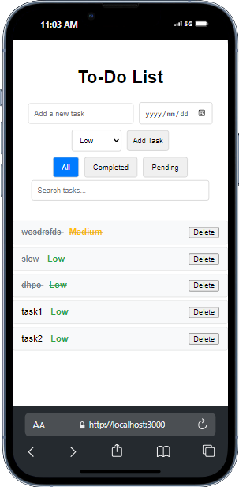

# To-Do List App

A simple React-based to-do list app that allows users to manage tasks with features like adding tasks, marking them as completed, filtering tasks, setting priorities, and searching through tasks. The app saves tasks to `localStorage`, so they persist even after refreshing the page. It also supports undoing the last task deletion.

## Features

- **Add Tasks**: Add tasks with descriptions, due dates, and priority levels.
- **Task Completion**: Mark tasks as completed or pending by clicking on them.
- **Delete Tasks**: Delete tasks and undo the deletion of the last task removed.
- **Filter Tasks**: Filter tasks based on their status (`All`, `Completed`, `Pending`).
- **Search Tasks**: Search for tasks by name.
- **Priority Levels**: Set task priority as `High`, `Medium`, or `Low`.
- **Persistence**: Tasks are saved in `localStorage`, so data is retained across page reloads.

## Screenshots



## Demo

You can view the demo of the app by visiting [here](https://your-github-pages-link.com).

## Installation

To run the app locally, follow these steps:

1. Clone this repository:
   ```bash
   git clone https://github.com/thapeloboya/todo-list-app.git
